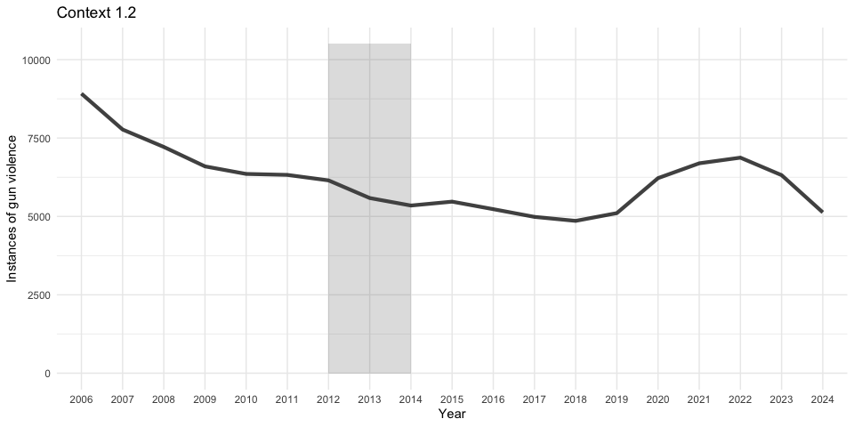

<figure>

<figcaption aria-hidden="true">Resolve Philly Logo</figcaption>
</figure>

<figure>

<figcaption aria-hidden="true">MindSite News Logo</figcaption>
</figure>

# Gun Violence and School Closings

By Julie Christie, Data & Impact Editor at [Resolve
Philly](https://www.resolvephilly.org), Gene Sonn, Director of
Collaborations at [Resolve Philly](https://www.resolvephilly.org)

Read our reporting here: *Article to come*

## Goal of Analysis

Understand gun violence in the neighborhoods surrounding schools closed
from 2012 through 2014, marking a mass closure for the city’s public
schools. Residents in those neighborhoods shared they felt gun violence
had gotten worse after the closures. This analysis will look at the
amount of gun violence in the surrounding 500 yards of a school (a
little more than a quarter of a mile, or three long city blocks in
Philadelphia) over time from 2006 through the end of October 2024. Then,
we will compare the gun violence around those schools to the overall gun
violence trends for the city.

## Glossary

-   **Gun violence** — According to the National Institute of Justice,
    “In a violent crime, a victim is harmed by or threatened with
    violence. Violent crimes include rape and sexual assault, robbery,
    assault and murder.” This analysis uses that definition, applied to
    the gun-related crimes the Philadelphia Police Department identify
    in their data: \|
    [Source](https://nij.ojp.gov/topics/crimes/violent-crime)
    -   Robbery with a firearm
    -   Aggravated assault with a firearm (this would encompass and
        mostly be shootings, as well as instances where people were
        wounded in other ways with a gun, like being beaten. Regardless,
        a gun was used in the carrying out of these crimes). This should
        also include domestic violence incidents, but that level of
        detail is not available in the PPD crime incident data.
    -   Criminal and justifiable homicide
-   **Closed School** — Between 2012-2014 the School District of
    Philadelphia closed 30 schools throughout the city. When this
    analysis references a closed school, it is from that period and does
    not include any schools that had closed previously or afterward.
-   **Immediate neighborhood** — The geography around a school within a
    500 yard/0.28 radius. This creates a
    slightly-more-than-half-mile-wide circle centered on the school that
    we use as a reference point in the analysis. We chose this distance
    because residents tend to feel the impact of gun violence not just
    on the block where it happened, but also within a few blocks of the
    violence.

## Resources used

### Data

-   [School Closing
    Addresses](https://docs.google.com/spreadsheets/d/1CzRWEmjMRlcWSF2XCtQXR2iBekYZnKKe-Bo65SPtB88/edit?usp=sharing)
    — Manually compiled addresses of Philadelphia schools closed in 2013
    and 2014
-   [Crime
    Incidents](https://opendataphilly.org/datasets/crime-incidents/) —
    Crime incidents in Philadelphia from 2006 through 2023 \|
    [Metadata/Data
    Dictionary](https://metadata.phila.gov/#home/datasetdetails/5543868920583086178c4f8e/representationdetails/570e7621c03327dc14f4b68d/)

### Tools

-   [R and VSCode](https://code.visualstudio.com/) — For cleaning,
    analyzing, and rough visualization of the data
-   [Google Sheets](https://workspace.google.com/products/sheets/) — For
    manually compiling school addresses
-   [Q-GIS](https://qgis.org/en/site/) — For mapping and calculating
    geographic relationships between schools and incidents of gun
    violence

### Limitations and Notes

-   This analysis should not be interpreted to mean that the school
    closings had a direct impact on the rates of gun violence in the
    schools’ surrounding neighborhoods or the city’s overall rates of
    gun violence. Gun violence is a very intersectional issue that can
    be correlated to many other factors in an environment or
    socioeconomic characteristics of a community, none of which are a
    direct reason for gun violence to exist.
-   This analysis does not include other violent crimes that may have
    involved a gun because the PPD data do not identify when those
    crimes involved a gun. The following crimes are:
    -   Rape
    -   Other sexual assaults
    -   Assaults other than aggravated assault
    -   Terroristic threats
-   This analysis excludes homicides categorized as “gross negligence”,
    two crimes total from 2006 through 2024 because they do not fall
    within the NIJ definition of violent crime.
-   This analysis does not incorporate all gun violence numbers in 2024
    because the analysis was completed before 2024 was commpleted,
    however it does contain the majority of 2024. 2024 numbers in the
    analysis will be lower than the actual annual total as a result of
    this.
-   The data for this analysis contain retroactive incidents for events
    that do not appear on the same day. For example, an event on
    Aug. 14, 2019 had further incidents added months later, with a new
    dispatch date in December, resulting in 68 incidents recorded for
    one event over the course of five months. There is no standardized
    way in the public data to determine other occurrences like this,
    however Philadelphia Police believe that this is rare within the
    data. We later attempted to identify possible similar situations by
    looking for incidents with the same dispatch time (not date),
    location, and UCR general code.
-   A little less than 2% of the gun violence incidents (2371) have no
    latitude or longitude coordinates due to misspellings in the address
    field.

### Libraries and global settings

For R

``` r
options(scipen = 999) # Do not return results in scientific notation
library(tidygeocoder) # For geocoding
library(sf)           # Load Simple Features for R
library(broom)        # Mapping functions
library(tidyverse)    # For easier coding

# Set theme for graphics
theme_set(theme_minimal())
```

## Cleaning

Load in school address data

``` r
#Import School Data
data_schools <- read_tsv("data/closed_schools.tsv")
```

Clean and update the closed schools dataset

``` r
data_schools <- data_schools %>%
  #Create new columns
  mutate(
    #For school type, based on name of school
    School_Type = case_when(
      grepl("\\bhigh\\b", Full_Name, ignore.case = TRUE) ~ "High",
      grepl("\\bmiddle\\b", Full_Name, ignore.case = TRUE) ~ "Middle",
      grepl("\\belementary\\b", Full_Name, ignore.case = TRUE) ~ "Elementary",
      TRUE ~ "UNK")) %>%
  #Keep only columns needed for analysis
  select(Full_Name,
    Full_Address,
    Street_Number,
    City,
    ZIP,
    Status,
    Year_Closed,
    School_Type)
```

Go through and, if necessary, manually update any schools that do not
have a grade level established in the `School_Type` field.

Geocode the addresses!

``` r
#Geocoding
geo_all_schools <- geocode(data_schools,
                           address = Full_Address,
                           method = "arcgis",
                           full_results = TRUE)
#Convert to Simple Frame
geo_all_schools <- geo_all_schools %>%
  st_as_sf(coords = c("long", "lat"),
           crs = st_crs("EPSG:4326"))
```

Export the school data to be ready for QGIS mapping and analysis

``` r
write.csv(geo_all_schools, "data/geo_all_schools.csv", row.names = FALSE)
```

Import all of the crime data from Philadelphia police to add some
universal categories, and then separate into each individual year to
import into QGIS. Each year is available as its own .csv file. A
download of all the data in one go will time out from the datasource.

``` r
crime_2006 <- read_csv("https://phl.carto.com/api/v2/sql?filename=incidents_part1_part2&format=csv&skipfields=cartodb_id,the_geom,the_geom_webmercator&q=SELECT%20*%20,%20ST_Y(the_geom)%20AS%20lat,%20ST_X(the_geom)%20AS%20lng%20FROM%20incidents_part1_part2%20WHERE%20dispatch_date_time%20%3E=%20%272006-01-01%27%20AND%20dispatch_date_time%20%3C%20%272007-01-01%27")
crime_2007 <- read_csv("https://phl.carto.com/api/v2/sql?filename=incidents_part1_part2&format=csv&skipfields=cartodb_id,the_geom,the_geom_webmercator&q=SELECT%20*%20,%20ST_Y(the_geom)%20AS%20lat,%20ST_X(the_geom)%20AS%20lng%20FROM%20incidents_part1_part2%20WHERE%20dispatch_date_time%20%3E=%20%272007-01-01%27%20AND%20dispatch_date_time%20%3C%20%272008-01-01%27")
crime_2008 <- read_csv("https://phl.carto.com/api/v2/sql?filename=incidents_part1_part2&format=csv&skipfields=cartodb_id,the_geom,the_geom_webmercator&q=SELECT%20*%20,%20ST_Y(the_geom)%20AS%20lat,%20ST_X(the_geom)%20AS%20lng%20FROM%20incidents_part1_part2%20WHERE%20dispatch_date_time%20%3E=%20%272008-01-01%27%20AND%20dispatch_date_time%20%3C%20%272009-01-01%27")
crime_2009 <- read_csv("https://phl.carto.com/api/v2/sql?filename=incidents_part1_part2&format=csv&skipfields=cartodb_id,the_geom,the_geom_webmercator&q=SELECT%20*%20,%20ST_Y(the_geom)%20AS%20lat,%20ST_X(the_geom)%20AS%20lng%20FROM%20incidents_part1_part2%20WHERE%20dispatch_date_time%20%3E=%20%272009-01-01%27%20AND%20dispatch_date_time%20%3C%20%272010-01-01%27")
crime_2010 <- read_csv("https://phl.carto.com/api/v2/sql?filename=incidents_part1_part2&format=csv&skipfields=cartodb_id,the_geom,the_geom_webmercator&q=SELECT%20*%20,%20ST_Y(the_geom)%20AS%20lat,%20ST_X(the_geom)%20AS%20lng%20FROM%20incidents_part1_part2%20WHERE%20dispatch_date_time%20%3E=%20%272010-01-01%27%20AND%20dispatch_date_time%20%3C%20%272011-01-01%27")
crime_2011 <- read_csv("https://phl.carto.com/api/v2/sql?filename=incidents_part1_part2&format=csv&skipfields=cartodb_id,the_geom,the_geom_webmercator&q=SELECT%20*%20,%20ST_Y(the_geom)%20AS%20lat,%20ST_X(the_geom)%20AS%20lng%20FROM%20incidents_part1_part2%20WHERE%20dispatch_date_time%20%3E=%20%272011-01-01%27%20AND%20dispatch_date_time%20%3C%20%272012-01-01%27")
crime_2012 <- read_csv("https://phl.carto.com/api/v2/sql?filename=incidents_part1_part2&format=csv&skipfields=cartodb_id,the_geom,the_geom_webmercator&q=SELECT%20*%20,%20ST_Y(the_geom)%20AS%20lat,%20ST_X(the_geom)%20AS%20lng%20FROM%20incidents_part1_part2%20WHERE%20dispatch_date_time%20%3E=%20%272012-01-01%27%20AND%20dispatch_date_time%20%3C%20%272013-01-01%27")
crime_2013 <- read_csv("https://phl.carto.com/api/v2/sql?filename=incidents_part1_part2&format=csv&skipfields=cartodb_id,the_geom,the_geom_webmercator&q=SELECT%20*%20,%20ST_Y(the_geom)%20AS%20lat,%20ST_X(the_geom)%20AS%20lng%20FROM%20incidents_part1_part2%20WHERE%20dispatch_date_time%20%3E=%20%272013-01-01%27%20AND%20dispatch_date_time%20%3C%20%272014-01-01%27")
crime_2014 <- read_csv("https://phl.carto.com/api/v2/sql?filename=incidents_part1_part2&format=csv&skipfields=cartodb_id,the_geom,the_geom_webmercator&q=SELECT%20*%20,%20ST_Y(the_geom)%20AS%20lat,%20ST_X(the_geom)%20AS%20lng%20FROM%20incidents_part1_part2%20WHERE%20dispatch_date_time%20%3E=%20%272014-01-01%27%20AND%20dispatch_date_time%20%3C%20%272015-01-01%27")
crime_2015 <- read_csv("https://phl.carto.com/api/v2/sql?filename=incidents_part1_part2&format=csv&skipfields=cartodb_id,the_geom,the_geom_webmercator&q=SELECT%20*%20,%20ST_Y(the_geom)%20AS%20lat,%20ST_X(the_geom)%20AS%20lng%20FROM%20incidents_part1_part2%20WHERE%20dispatch_date_time%20%3E=%20%272015-01-01%27%20AND%20dispatch_date_time%20%3C%20%272016-01-01%27")
crime_2016 <- read_csv("https://phl.carto.com/api/v2/sql?filename=incidents_part1_part2&format=csv&skipfields=cartodb_id,the_geom,the_geom_webmercator&q=SELECT%20*%20,%20ST_Y(the_geom)%20AS%20lat,%20ST_X(the_geom)%20AS%20lng%20FROM%20incidents_part1_part2%20WHERE%20dispatch_date_time%20%3E=%20%272016-01-01%27%20AND%20dispatch_date_time%20%3C%20%272017-01-01%27")
crime_2017 <- read_csv("https://phl.carto.com/api/v2/sql?filename=incidents_part1_part2&format=csv&skipfields=cartodb_id,the_geom,the_geom_webmercator&q=SELECT%20*%20,%20ST_Y(the_geom)%20AS%20lat,%20ST_X(the_geom)%20AS%20lng%20FROM%20incidents_part1_part2%20WHERE%20dispatch_date_time%20%3E=%20%272017-01-01%27%20AND%20dispatch_date_time%20%3C%20%272018-01-01%27")
crime_2018 <- read_csv("https://phl.carto.com/api/v2/sql?filename=incidents_part1_part2&format=csv&skipfields=cartodb_id,the_geom,the_geom_webmercator&q=SELECT%20*%20,%20ST_Y(the_geom)%20AS%20lat,%20ST_X(the_geom)%20AS%20lng%20FROM%20incidents_part1_part2%20WHERE%20dispatch_date_time%20%3E=%20%272018-01-01%27%20AND%20dispatch_date_time%20%3C%20%272019-01-01%27")
crime_2019 <- read_csv("https://phl.carto.com/api/v2/sql?filename=incidents_part1_part2&format=csv&skipfields=cartodb_id,the_geom,the_geom_webmercator&q=SELECT%20*%20,%20ST_Y(the_geom)%20AS%20lat,%20ST_X(the_geom)%20AS%20lng%20FROM%20incidents_part1_part2%20WHERE%20dispatch_date_time%20%3E=%20%272019-01-01%27%20AND%20dispatch_date_time%20%3C%20%272020-01-01%27")

# Manually added to the URL to skip the fields the_geom, cartodb_id, and the_geom_webmercator with code &skipfields=cartodb_id,the_geom,the_geom_webmercator
crime_2020 <- read_csv("https://phl.carto.com/api/v2/sql?filename=incidents_part1_part2&format=csv&skipfields=cartodb_id,the_geom,the_geom_webmercator&q=SELECT%20*%20,%20ST_Y(the_geom)%20AS%20lat,%20ST_X(the_geom)%20AS%20lng%20FROM%20incidents_part1_part2%20WHERE%20dispatch_date_time%20%3E=%20%272020-01-01%27%20AND%20dispatch_date_time%20%3C%20%272021-01-01%27")
crime_2021 <- read_csv("https://phl.carto.com/api/v2/sql?filename=incidents_part1_part2&format=csv&skipfields=cartodb_id,the_geom,the_geom_webmercator&q=SELECT%20*%20,%20ST_Y(the_geom)%20AS%20lat,%20ST_X(the_geom)%20AS%20lng%20FROM%20incidents_part1_part2%20WHERE%20dispatch_date_time%20%3E=%20%272021-01-01%27%20AND%20dispatch_date_time%20%3C%20%272022-01-01%27")
crime_2022 <- read_csv("https://phl.carto.com/api/v2/sql?filename=incidents_part1_part2&format=csv&skipfields=cartodb_id,the_geom,the_geom_webmercator&q=SELECT%20*%20,%20ST_Y(the_geom)%20AS%20lat,%20ST_X(the_geom)%20AS%20lng%20FROM%20incidents_part1_part2%20WHERE%20dispatch_date_time%20%3E=%20%272022-01-01%27%20AND%20dispatch_date_time%20%3C%20%272023-01-01%27")
crime_2023 <- read_csv("https://phl.carto.com/api/v2/sql?filename=incidents_part1_part2&format=csv&skipfields=cartodb_id,the_geom,the_geom_webmercator&q=SELECT%20*%20,%20ST_Y(the_geom)%20AS%20lat,%20ST_X(the_geom)%20AS%20lng%20FROM%20incidents_part1_part2%20WHERE%20dispatch_date_time%20%3E=%20%272023-01-01%27%20AND%20dispatch_date_time%20%3C%20%272024-01-01%27")
crime_2024 <- read_csv("https://phl.carto.com/api/v2/sql?filename=incidents_part1_part2&format=csv&skipfields=cartodb_id,the_geom,the_geom_webmercator&q=SELECT%20*%20,%20ST_Y(the_geom)%20AS%20lat,%20ST_X(the_geom)%20AS%20lng%20FROM%20incidents_part1_part2%20WHERE%20dispatch_date_time%20%3E=%20%272024-01-01%27%20AND%20dispatch_date_time%20%3C%20%272025-01-01%27")
```

Combine each dataframe of crime incidents into one large dataframe

``` r
all_crime <- bind_rows(crime_2006, crime_2007, crime_2008, crime_2009, crime_2010, crime_2011, crime_2012, crime_2013, crime_2014, crime_2015, crime_2016, crime_2017, crime_2018, crime_2019, crime_2020, crime_2021, crime_2022, crime_2023, crime_2024)

# Remove individual year dataframes to clean up the workspace
rm("crime_2006",
   "crime_2007",
   "crime_2008",
   "crime_2009",
   "crime_2010",
   "crime_2011",
   'crime_2012',
   "crime_2013",
   "crime_2014",
   "crime_2015",
   "crime_2016",
   "crime_2017",
   "crime_2018",
   "crime_2019",
   "crime_2020",
   "crime_2021",
   "crime_2022",
   "crime_2023",
   "crime_2024")
```

Add further columns for analysis

``` r
# Set year column
all_crime$year <- format(as.Date(all_crime$dispatch_date, format="%Y-%m-%d"), "%Y")

# Identify gun violence
all_crime <- all_crime %>%
  mutate(GunViolence = case_when(
    text_general_code == "Aggravated Assault Firearm" |
    text_general_code == "Homicide - Criminal" |
    text_general_code == "Homicide - Justifiable" |
    text_general_code == "Robbery Firearm" ~ "Y",
    TRUE ~ "N"))
```

Create a new table for only gun violence, also filtering out known
retroactive additions

``` r
all_gv_incidents <- all_crime %>%
  filter(GunViolence == "Y")

retroactive_incidents <- all_crime %>%
  filter(GunViolence == "Y",
         dispatch_date == "2019-12-17",
         location_block == "3700 BLOCK N 15TH ST")

# Remove the retroactive incidents
all_gv_incidents <- all_gv_incidents %>%
  anti_join(retroactive_incidents, all_gv_incidents, by = 'dc_key')
```

Export CrimeIncidents_GunRelated as a .csv file to use in QGIS, one .csv
for each year

``` r
crime_2006 <- all_gv_incidents %>%
  filter(year == 2006)
crime_2007 <- all_gv_incidents %>%
  filter(year == 2007)
crime_2008 <- all_gv_incidents %>%
  filter(year == 2008)
crime_2009 <- all_gv_incidents %>%
  filter(year == 2009)
crime_2010 <- all_gv_incidents %>%
  filter(year == 2010)
crime_2011 <- all_gv_incidents %>%
  filter(year == 2011)
crime_2012 <- all_gv_incidents %>%
  filter(year == 2012)
crime_2013 <- all_gv_incidents %>%
  filter(year == 2013)
crime_2014 <- all_gv_incidents %>%
  filter(year == 2014)
crime_2015 <- all_gv_incidents %>%
  filter(year == 2015)
crime_2016 <- all_gv_incidents %>%
  filter(year == 2016)
crime_2017 <- all_gv_incidents %>%
  filter(year == 2017)
crime_2018 <- all_gv_incidents %>%
  filter(year == 2018)
crime_2019 <- all_gv_incidents %>%
  filter(year == 2019)
crime_2020 <- all_gv_incidents %>%
  filter(year == 2020)
crime_2021 <- all_gv_incidents %>%
  filter(year == 2021)
crime_2022 <- all_gv_incidents %>%
  filter(year == 2022)
crime_2023 <- all_gv_incidents %>%
  filter(year == 2023)
crime_2024 <- all_gv_incidents %>%
  filter(year == 2024)

write.csv(crime_2006, "2006.csv")
write.csv(crime_2007, "2007.csv")
write.csv(crime_2008, "2008.csv")
write.csv(crime_2009, "2009.csv")
write.csv(crime_2010, "2010.csv")
write.csv(crime_2011, "2011.csv")
write.csv(crime_2012, "2012.csv")
write.csv(crime_2013, "2013.csv")
write.csv(crime_2014, "2014.csv")
write.csv(crime_2015, "2015.csv")
write.csv(crime_2016, "2016.csv")
write.csv(crime_2017, "2017.csv")
write.csv(crime_2018, "2018.csv")
write.csv(crime_2019, "2019.csv")
write.csv(crime_2020, "2020.csv")
write.csv(crime_2021, "2021.csv")
write.csv(crime_2022, "2022.csv")
write.csv(crime_2023, "2023.csv")
write.csv(crime_2024, "2024.csv")

rm("crime_2006",
   "crime_2007",
   "crime_2008",
   "crime_2009",
   "crime_2010",
   "crime_2011",
   'crime_2012',
   "crime_2013",
   "crime_2014",
   "crime_2015",
   "crime_2016",
   "crime_2017",
   "crime_2018",
   "crime_2019",
   "crime_2020",
   "crime_2021",
   "crime_2022",
   "crime_2023",
   "crime_2024")
```

Import the school catchment area data as vector dataset into QGIS

Upload the `geo_all_schools.csv` file into QGIS as a vector dataset

This layer should have a symbology showing a semi-transparent light blue
radius around each school in a 500 yard distance, which is set by
`Size: 457.2` set to `Meters at Scale` and centered on the anchor
point. 1. **Note:** `457.2 meters` is equivalent to `500 yards`

Upload each year of crime incidents data as a vector dataset

1.  Map possible X to `point_x` and possible Y to `point_y`
2.  Because a projection cannot be set for a .csv, it should be set to
    that of the project (`EPSG: 4326`)
3.  The crime incident symbology does not matter, but it’s recommended
    to make the crime incidents smaller than the dots for the schools
    and add discrete color
4.  Duplicate `geo_all_schools` and then toggle it as “editable” with a
    right click. Name this new layer `calculated_schools`
5.  Open the [Field Calculator (Abacus
    symbol)](https://external-content.duckduckgo.com/iu/?u=https%3A%2F%2Fi.stack.imgur.com%2FTIHzx.png&f=1&nofb=1&ipt=3a17d59aa582e41695aba1586951eb6f433feedd311762f659cc2b4ec7bf7509&ipo=images)
    to input the following information, and repeat to create a new
    column for each year:
    1.  **Create a new field: `Checked`**
    2.  **Create virtual field: `Unchecked`**
    3.  **Output field name:** *Input name of export file you want to
        create, with convention* `YEAR`
    4.  **Output field type:** `Integer (32 bit)`
    5.  **Output field length:** `10`
    6.  **Precision:** `3`
    7.  **Expression:** *This expression [was created and then
        saved](https://gis.stackexchange.com/questions/387083/saving-expressions-in-qgis)
        in QGIS \> Field Calculator\> User expressions \>
        `CalculateShootings500Yards`*

> \[!NOTE\] `0.0027` was determined through spot checking a manual count
> of points within the radius and the calculated result. The spot check
> was done on schools with gun violence incidents incredibly close
> to/directly on the edge of the radius.

``` python
array_length(
    overlay_nearest (
        'YEAR',
        $id,
        limit:=-1,
        max_distance:=0.0027
    )
)
```

Toggle off editing for `Geo_AllSchools` and make sure to save the
changes to the data table in your Data folder.

Re-upload the QGIS calculated data and fix the year columns to not start
with a number.
[Reference](%22https://stackoverflow.com/questions/66248086/adding-prefix-to-specific-r-columns%22)

``` r
data_school_calc <- read_csv("data/calculated_schools.csv")
```

Tidy up the `data_school_calc` to be ready for visualization in R

``` r
analysis_cs_timeline <- data_school_calc %>%
  gather("Year", "GunRelated_Incidents", "2006":"2023") %>%
  select(Full_Name, Year, GunRelated_Incidents) %>%
  spread(key = Full_Name, value = GunRelated_Incidents)

#tidy table
analysis_schools <- data_school_calc %>%
  gather("Year", "GunRelated_Incidents", "2006":"2023") %>%
  select("Full_Name",
    "Status",
    "School_Type",
    "Year_Closed",
    "Year",
    "GunRelated_Incidents")
```

## Analysis

### Context of gun violence in Philadelphia

> \[!NOTE\] The highlighted grey bars on most graphics highlight the
> closure of 30 schools from 2012-2014.

Before diving into school-specific data, is important for us to
understand crime and gun violence citywide. First, we need to understand
how much of overall crime gun violence accounts for. As seen in
**Context 1.1**, gun violence has accounted for between 3 and 5 percent
of all crime in the city. The dramatic increase from 2019 through 2023
was largely driven by the pandemic and its fallout. There is no clear
visible dramatic effect of the school closures on the citywide levels of
gun violence.

``` r
all_crime_annual <- all_crime %>%
  group_by(year, GunViolence) %>%
  summarise(tot_crime = n(), na.rm = TRUE) %>%
  mutate(pct = tot_crime / sum(tot_crime) * 100)

ggplot(all_crime_annual,
  aes(x = year,
      y = pct,
      group = GunViolence,
      order = year,
      fill = GunViolence)) +
  geom_area(alpha = .75, size=.5, colour="white") +
  theme(legend.position = "none") +
  annotate("rect", xmin = 7, xmax = 9, ymin = 0, ymax = 100, alpha = .2) +
  labs(
    y = "Percent",
    x = "Year",
    title = "Context 1.1")
```


Next it is important to know how much gun violence is actually happening
in Philadelphia. **Context 1.2** shows that the overall amount of gun
violence in Philadelphia was decreasing from 2006 through 2018, but rose
from 2019-2023. Again, there is no direct relationship effect seen from
the school closures.

``` r
crime_timeline <- all_gv_incidents %>%
  group_by(year) %>%
  summarise(cases = n())

ggplot(data = crime_timeline,
       aes(x = year, y = cases, group = 1)) +
  geom_line(linewidth = 1.5, alpha = .75) +
  #Labels
  annotate("rect", xmin = 7, xmax = 9, ymin = 0, ymax = 10500, alpha = .2) +
  labs(
    y = "Instances of gun violence",
    x = "Year",
    title = "Context 1.2")
```



# Export for graphics

Export `.csv` file of data to create graphics

``` r
# All schools with calculation of gun violence in the surrounding area from 2006-2023
write.csv(analysis_schools, "data/analysis_schools.csv")

# Annual totals of gun violence across Philadelphia
write.csv(crime_timeline,"data/gunviolence_timeline.csv")
```

# Future Work or Questions

-   What were the criteria for closing other schools at different times?
    What is gun violence like around those schools?
-   What drives the difference in gun violence around different grade
    levels, if any?
-   How could this analysis be enriched by taking the same look at the
    presence of an open recreation center or public library within a
    certain distance of the closed schools?
-   Can a similar analysis be conducted to see if there is a similar
    pattern of gun violence in the presence of a large empty building?
-   Future reporting and analysis on this could take into account all
    schools that may have closed from 2006 to the current year to
    increase the sample size of closed schools to 100% and explore the
    relationship to gun violence.
-   What does this analysis show when applied to other cities,
    especially those that had mass-school-closures?
