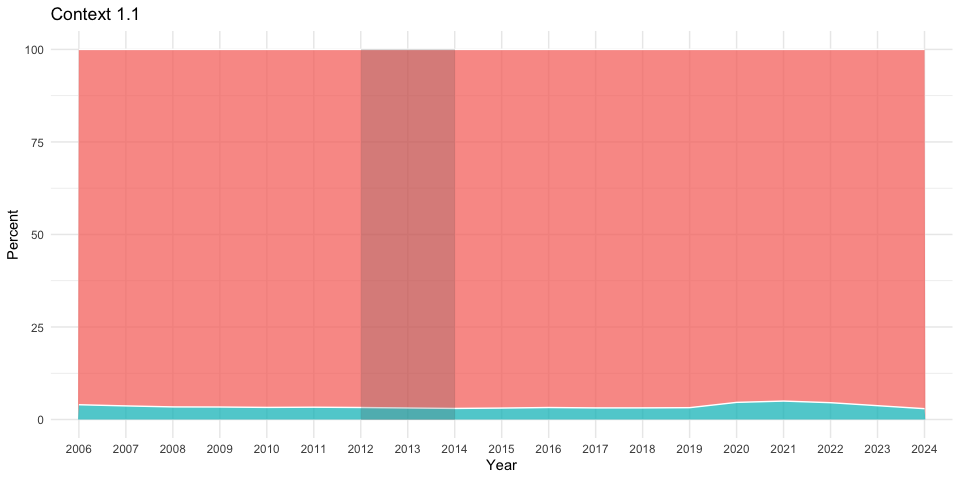

<figure>

<figcaption aria-hidden="true">Resolve Philly Logo</figcaption>
</figure>

<figure>

<figcaption aria-hidden="true">MindSite News Logo</figcaption>
</figure>

# Gun Violence and School Closings

By Julie Christie, Data & Impact Editor at [Resolve
Philly](https://www.resolvephilly.org), Gene Sonn, Director of
Collaborations at [Resolve Philly](https://www.resolvephilly.org)

Read our reporting here: *Article to come*

## Goal of Analysis

Find out whether the 2012-14 closing of 30 schools in Philadelphia have
a correlation with the rate of gun violence in their immediate
neighborhoods.

## Glossary

-   **Gun violence** — According to the National Institute of Justice,
    “In a violent crime, a victim is harmed by or threatened with
    violence. Violent crimes include rape and sexual assault, robbery,
    assault and murder.” This analysis uses that definition, applied to
    the gun-related crimes the Philadelphia Police identify in their
    data: \| [Source](https://nij.ojp.gov/topics/crimes/violent-crime)
    -   Robbery with a firearm
    -   Aggravated assault with a firearm (this would encompass and
        mostly be shootings, as well as instances where people were
        wounded in other ways with a gun, like being beaten. Regardless,
        a gun was used in the carrying out of these crimes)
    -   Criminal and justifiable homicide
-   **Closed School** — Between 2012-2014 the School District of
    Philadelphia closed 30 schools throughout the city. When this
    analysis references a closed school, it is from that period and does
    not include any schools that had closed previously or afterward.
-   **Immediate neighborhood** — The geography around a school within a
    0.5 mile radius. This creates a mile-wide circle centered on the
    school that we use as a reference point in the analysis.

## Resources used

### Data

-   [School Closing
    Addresses](https://docs.google.com/spreadsheets/d/1CzRWEmjMRlcWSF2XCtQXR2iBekYZnKKe-Bo65SPtB88/edit?usp=sharing)
    — Manually compiled addresses of Philadelphia schools closed in 2013
    and 2014
-   [Crime
    Incidents](https://opendataphilly.org/datasets/crime-incidents/) —
    Crime incidents in Philadelphia from 2006 through 2023 \|
    [Metadata/Data
    Dictionary](https://metadata.phila.gov/#home/datasetdetails/5543868920583086178c4f8e/representationdetails/570e7621c03327dc14f4b68d/)
-   [School Catchment
    Areas](https://www.philasd.org/performance/programsservices/open-data/school-information/#school_catchment_areas)
    — Geographic boundaries that indicate Philadelphia school catchment
    zones. Specific data set is SY 2021-2022 School Catchment Areas
-   [Open School
    Addresses](https://www.philasd.org/performance/programsservices/open-data/school-information/#school_lists)
    — Downloaded from the Philadelphia School District Open Data page.
    Specific data set is the SY 2023-2024 School List

### Tools

-   [R and VSCode](https://code.visualstudio.com/) — For cleaning and
    analyzing the data
-   [Google Sheets](LinkToTool) — For manually compiling school
    addresses
-   [Q-GIS](https://qgis.org/en/site/) — For mapping and calculating
    geographic relationships between schools and incidents of gun
    violence

### Limitations and Notes

-   This analysis does not include other violent crimes that may have
    involved a gun because the PPD data does not identify when those
    crimes involved a gun. The following crimes are:
    -   Rape
    -   Other sexual assaults
    -   Other assaults
    -   Terroristic threats
-   This analysis excludes homicides categorized as “gross negligence”,
    two crimes total from 2006 through 2024
-   This analysis does not incorporate gun violence numbers in 2024
    because the analysis aggregates to the year and was published in
    2024
-   This analysis excludes crime incidents around a school that happened
    before it opened. This is to gain an accurate count of crime
    incidents around a school while it was open, and not before. Out of
    the combined 329 open schools, 83 schools opened after 2006, and 37
    schools opened after 2013.

### Libraries and global settings

For R

``` r
options(scipen = 999) # Do not return results in scientific notation
library(tidygeocoder) # For geocoding
library(sf)           # Load Simple Features for R
library(broom)        # Mapping functions
library(tidyverse)    # For easier coding

# Set theme for graphics
theme_set(theme_minimal())
```

## Cleaning

Load in school address data

``` r
#Import School Data
data_school_closed <- read_tsv("data/closed_schools.tsv")
data_school_open <- read_csv("data/MasterSchoolList_2324.csv")
```

Update each dataset to be ready to merge with each other

``` r
data_school_closed <- data_school_closed %>%
  #Create new columns
  mutate(
    #For year the school opened, set all blank
    Year_Opened = NA,
    #For school type, based on name of school
    School_Type = case_when(
      grepl("\\bhigh\\b", Full_Name, ignore.case = TRUE) ~ "High",
      grepl("\\bmiddle\\b", Full_Name, ignore.case = TRUE) ~ "Middle",
      grepl("\\belementary\\b", Full_Name, ignore.case = TRUE) ~ "Elementary",
      TRUE ~ "UNK")) %>%
  #Keep only columns needed for analysis
  select(Full_Name,
    Full_Address,
    Street_Number,
    City,
    ZIP,
    Status,
    Year_Closed,
    Year_Opened,
    School_Type)

#Update Open schools to be ready for merge
data_school_open <- data_school_open %>%
  #Create new columns
  mutate(
    #For year the school closed, set all blank because the schools are open
    Year_Closed = NA,
    #For status, set all to be "Open"
    Status = "Open",
    #For Full_Address to geocode, essentially concat other fields
    Full_Address = paste(
      `Street Address`, ", ", City, ", ", State, " ", `Zip Code`,
      sep = "")) %>%
  #Rename columns to be identical to ClosedSchoolAdddress
  rename(
    Full_Name = `Publication Name`,
    Year_Opened = `Year Opened`,
    School_Type = `School Level`,
    Street_Number = `Street Address`,
    ZIP = `Zip Code`) %>%
  #Keep only columns needed for analysis, arranging them to be identical
  select(Full_Name,
    Full_Address,
    Street_Number,
    City,
    ZIP,
    Status,
    Year_Closed,
    Year_Opened,
    School_Type)
```

Create a new table that combines the two sets

``` r
data_school_all <- full_join(data_school_open, data_school_closed)
```

Go through and, if necessary, manually update any schools that do not
have a grade level established in the `School_Type` field.

Geocode the addresses!

``` r
#Geocoding
geo_all_schools <- geocode(data_school_all,
                           address = Full_Address,
                           method = "arcgis",
                           full_results = TRUE)
#Convert to Simple Frame
geo_all_schools <- geo_all_schools %>%
  st_as_sf(coords = c("long", "lat"),
           crs = st_crs("EPSG:4326"))
```

Export the school data to be ready for QGIS mapping and analysis

``` r
write.csv(geo_all_schools, "data/geo_all_schools.csv", row.names = FALSE)
```

Import all of the crime data from Philadelphia police.

``` r
# Fix date format upon import
all_crime <- read_csv("data/all_PHL_crime.csv",
  col_types = cols(dispatch_date = col_date(format = "%Y-%m-%d"),
  dispatch_time = col_time(format = "%H:%M:%S")))

# Set year column
all_crime$year <- format(as.Date(all_crime$dispatch_date, format="%Y-%m-%d"), "%Y")

# Identify gun violence
all_crime <- all_crime %>%
  mutate(GunViolence = case_when(
    text_general_code == "Aggravated Assault Firearm" |
    text_general_code == "Homicide - Criminal" |
    text_general_code == "Homicide - Justifiable" |
    text_general_code == "Robbery Firearm" ~ "Y",
    TRUE ~ "N"))
```

Create a new table for only gun violence

``` r
all_gv_incidents <- all_crime %>%
  filter(GunViolence == "Y")
```

Add information to the gun violence table that parses out year alone.

``` r
#Add year as column
all_gv_incidents$year <- format(
  as.Date(all_gv_incidents$dispatch_date, format = "%Y-%m-%d"), "%Y")
```

Export CrimeIncidents_GunRelated as a .csv file to use in QGIS, one .csv
for each year

``` r
crime_2006 <- all_gv_incidents %>%
  filter(year == 2006)
crime_2007 <- all_gv_incidents %>%
  filter(year == 2007)
crime_2008 <- all_gv_incidents %>%
  filter(year == 2008)
crime_2009 <- all_gv_incidents %>%
  filter(year == 2009)
crime_2010 <- all_gv_incidents %>%
  filter(year == 2010)
crime_2011 <- all_gv_incidents %>%
  filter(year == 2011)
crime_2012 <- all_gv_incidents %>%
  filter(year == 2012)
crime_2013 <- all_gv_incidents %>%
  filter(year == 2013)
crime_2014 <- all_gv_incidents %>%
  filter(year == 2014)
crime_2015 <- all_gv_incidents %>%
  filter(year == 2015)
crime_2016 <- all_gv_incidents %>%
  filter(year == 2016)
crime_2017 <- all_gv_incidents %>%
  filter(year == 2017)
crime_2018 <- all_gv_incidents %>%
  filter(year == 2018)
crime_2019 <- all_gv_incidents %>%
  filter(year == 2019)
crime_2020 <- all_gv_incidents %>%
  filter(year == 2020)
crime_2021 <- all_gv_incidents %>%
  filter(year == 2021)
crime_2022 <- all_gv_incidents %>%
  filter(year == 2022)
crime_2023 <- all_gv_incidents %>%
  filter(year == 2023)

write.csv(crime_2006, "2006.csv")
write.csv(crime_2007, "2007.csv")
write.csv(crime_2008, "2008.csv")
write.csv(crime_2009, "2009.csv")
write.csv(crime_2010, "2010.csv")
write.csv(crime_2011, "2011.csv")
write.csv(crime_2012, "2012.csv")
write.csv(crime_2013, "2013.csv")
write.csv(crime_2014, "2014.csv")
write.csv(crime_2015, "2015.csv")
write.csv(crime_2016, "2016.csv")
write.csv(crime_2017, "2017.csv")
write.csv(crime_2018, "2018.csv")
write.csv(crime_2019, "2019.csv")
write.csv(crime_2020, "2020.csv")
write.csv(crime_2021, "2021.csv")
write.csv(crime_2022, "2022.csv")
write.csv(crime_2023, "2023.csv")

rm("crime_2006",
   "crime_2007",
   "crime_2008",
   "crime_2009",
   "crime_2010",
   "crime_2011",
   'crime_2012',
   "crime_2013",
   "crime_2014",
   "crime_2015",
   "crime_2016",
   "crime_2017",
   "crime_2018",
   "crime_2019",
   "crime_2019",
   "crime_2020",
   "crime_2021",
   "crime_2022",
   "crime_2023")
```

Import the school catchment area data as vector dataset into QGIS

Upload the `Geo_AllSchools.csv` file into QGIS as a vector dataset

1.  Color symbology is rule-based for closed schools with Red dots, and
    opened schools with green dots
2.  To create the rule, first set Open Schools to have a filter of
    `"Status" = 'Open'` and then use the red symbology for the Closed
    Schools. Closed schools have no filter and are instead identified as
    `Else` to apply the symbology.
3.  Both should have a second symbology showing a semi-transparent light
    blue radius around each school in a 0.5 mile distance, which is set
    by `Size: 804.672000` set to `Meters at Scale` and centered on the
    anchor point.
    1.  **Note:** `804.672000 Meters` is equivalent to `0.5 Miles`

Upload each year of crime incidents data as a vector dataset

1.  Map possible X to `point_x` and possible Y to `point_y`
2.  Because a projection cannot be set for a .csv, it should be set to
    that of the project (`EPSG: 4326`)
3.  The crime incident symbology does not matter, but it’s recommended
    to make the crime incidents smaller than the dots for the schools
    and add discrete color
4.  Duplicate `geo_all_schools` and then toggle it as “editable” with a
    right click. Name this new layer `calculated_schools`
5.  Open the [Field Calculator (Abacus
    symbol)](https://external-content.duckduckgo.com/iu/?u=https%3A%2F%2Fi.stack.imgur.com%2FTIHzx.png&f=1&nofb=1&ipt=3a17d59aa582e41695aba1586951eb6f433feedd311762f659cc2b4ec7bf7509&ipo=images)
    to input the following information, and repeat to create a new
    column for each year:
    1.  **Create a new field: `Checked`**
    2.  **Create virtual field: `Unchecked`**
    3.  **Output field name:** *Input name of export file you want to
        create, with convention* `YEAR`
    4.  **Output field type:** `Integer (32 bit)`
    5.  **Output field length:** `10`
    6.  **Precision:** `3`
    7.  **Expression:** *This expression [was created and then
        saved](https://gis.stackexchange.com/questions/387083/saving-expressions-in-qgis)
        in QGIS \> Field Calculator\> User expressions \>
        `CalculateShootingsHalfMileREAL`*

> [!NOTE] 
> `0.005` was determined through trial and error with manual spot checks to confirm that the found crime incidents are within 0.5 miles of the schools.

``` python
array_length(
    overlay_nearest (
        'YEAR',
        $id,
        limit:=-1,
        max_distance:=0.005
    )
)
```

Toggle off editing for `Geo_AllSchools` and make sure to save the
changes to the data table in your Data folder.

Re-upload the QGIS calculated data and fix the year columns to not start
with a number.
[Reference](https://stackoverflow.com/questions/66248086/adding-prefix-to-specific-r-columns)

``` r
data_school_calc <- read_csv("data/calculated_schools.csv")
```

Tidy up the `data_school_calc` to be ready for visualization in R

``` r
analysis_cs_timeline <- data_school_calc %>%
  gather("Year", "GunRelated_Incidents", "2006":"2023") %>%
  select(Full_Name, Year, GunRelated_Incidents) %>%
  spread(key = Full_Name, value = GunRelated_Incidents)

#tidy table
analysis_schools <- data_school_calc %>%
  gather("Year", "GunRelated_Incidents", "2006":"2023") %>%
  select("Full_Name",
    "Status",
    "School_Type",
    "Year_Opened",
    "Year_Closed",
    "Year",
    "GunRelated_Incidents")
```

Remove gun violence in schools that occurred in years before the school
was open and calculate that median.

``` r
#Replace data in columns for years when the school was not open
analysis_while_open_schools <- analysis_schools

analysis_while_open_schools$GunRelated_Incidents[analysis_while_open_schools$Year_Opened > analysis_while_open_schools$Year] <- NaN

#Calculate median of violence when open
analysis_while_open_median <- analysis_while_open_schools %>%
  group_by(Full_Name, Status) %>%
  summarise(Med_Incidents = median(GunRelated_Incidents, na.rm = TRUE))
```

## Analysis

### Context of gun violence in Philadelphia

> [!NOTE] 
> The highlighted grey bars on most graphics highlight the closure of 30 schools from 2012-2014.

Before diving into school-specific data, is important for us to
understand crime and gun violence citywide. First, we need to understand
how much of overall crime gun violence accounts for. As seen in
**Context 1.1**, gun violence has accounted for between 3 and 5 percent
of all crime in the city. The dramatic increase from 2019 through 2023
was largely driven by the pandemic and its fallout. There is no clear
visible dramatic effect of the school closures on the citywide levels of
gun violence.

``` r
all_crime_annual <- all_crime %>%
  group_by(year, GunViolence) %>%
  summarise(tot_crime = n(), na.rm = TRUE) %>%
  mutate(pct = tot_crime / sum(tot_crime) * 100) %>%
  filter(year < 2024)

ggplot(all_crime_annual,
  aes(x = year,
      y = pct,
      group = GunViolence,
      order = year,
      fill = GunViolence)) +
  geom_area(alpha = .75, size=.5, colour="white") +
  theme(legend.position = "none") +
  annotate("rect", xmin = 7, xmax = 9, ymin = 0, ymax = 100, alpha = .2) +
  labs(
    y = "Percent",
    x = "Year",
    title = "Context 1.1")
```



Next it is important to know how much gun violence is actually happening
in Philadelphia. **Context 1.2** shows that the overall amount of gun
violence in Philadelphia was decreasing from 2006 through 2018, but
drastically rose from 2019-2023. Again, there is no direct relationship
effect seen from the school closures.

``` r
crime_timeline <- all_gv_incidents %>%
  filter(year < 2024) %>%
  group_by(year) %>%
  summarise(cases = n())

ggplot(data = crime_timeline,
       aes(x = year, y = cases, group = 1)) +
  geom_line(linewidth = 1.5, alpha = .75) +
  #Labels
  annotate("rect", xmin = 7, xmax = 9, ymin = 0, ymax = 10500, alpha = .2) +
  labs(
    y = "Instances of gun violence",
    x = "Year",
    title = "Context 1.2")
```


Now that we understand the citywide picture of gun violence, we need to
have a baseline for how much gun violence there is around Philadelphia’s
schools. For this analysis, we examined a total of 359 schools. However,
we must account for the opening of schools across the timeline from
2006-2023. This is because it would be inaccurate to include gun
violence in an area where there wasn’t a school at the time. However, we
are not applying the same logic to schools after they closed, because
this analysis specifically is examine the after-effects of a school
closing. **Context 1.3** shows us that the amount of gun violence around
schools trends very closely with the citywide levels of gun violence.
This also shows little impact across all schools after the school
closures.

``` r
graph_annual_sum <- analysis_while_open_schools %>%
  group_by(Year) %>%
  summarise(tot_Incidents = sum(GunRelated_Incidents, na.rm = TRUE))

ggplot(graph_annual_sum,
  aes(
    x = Year,
    y = tot_Incidents,
    group = 1
  )) +
  geom_line(aes(x = Year, y = tot_Incidents), linewidth = 1.5, alpha = .75) +
  annotate("rect", xmin = 7, xmax = 9, ymin = 0, ymax = 10500, alpha = .2) +
  labs(
    y = "Gun violence around schools",
    title = "Context 1.3"
  )
```


### Comparing closed and open schools

It is now time to explore the impact of school closures when applied
specifically to the schools closed in 2012-14 and the rest of the open
schools.

First, we need to know if there is an overall difference in the amount
of gun violence around the closed schools and open schools. This is
calculated by taking the total number of gun violence incidents around
each type of school and calculating the median amount of gun violence
for the past 17 years.

``` r
close_open_median <- analysis_while_open_schools %>%
  group_by(Status) %>%
  summarize(tot_median = median(GunRelated_Incidents, na.rm = TRUE))
```

**Table:** Comparing 2.1

| Status | Median gun violence |
|--------|---------------------|
| :---   |                 ---:|
| Closed | 25                  |
| Open   | 20                  |

This difference shows that the schools closed from 2012-14 experience
22% more gun violence in their immediate neighborhoods than today’s open
schools.

We should next see whether this disparity perpetuates across the years.
**Comparing 2.2** illustrates the amount of gun violence each school
experienced while they were open compared to the gun violence around the
30 closed schools. From the trendlines superimposed on the graphic (as
dotted lines), we can see two main things. First, we see that the
disparity between the open schools and the ones that were closed in
2012-2014 holds, but narrows as time goes on. The second thing we can
glean from this chart is that the gun violence around the closed schools
dropped after their closures.

``` r
graph_while_open_annual_median <- analysis_while_open_schools %>%
  group_by(Status, Year) %>%
  summarise(Med_Incidents = median(GunRelated_Incidents, na.rm = TRUE))

ggplot(graph_while_open_annual_median,
  aes(
    x = Year,
    y = Med_Incidents,
    group = Status,
    color = Status
  )) +
  geom_line(linewidth = 1.5, alpha = .75) +
  geom_smooth(linetype = 3, alpha = .15) +
  annotate("rect", xmin = 7, xmax = 9, ymin = 0, ymax = 50, alpha = .2) +
  labs(
    y = "Crime incidents",
    title = "Comparing 2.2",
  )
```


------------------------------------------------------------------------

#### Disinvestment

The schools that the Philadelphia School District closed are located
across the city, and their immediate surrounding neighborhoods have
various intersecting socio-economic characteristics. A common thread
among residents around these closed schools were a sense of systemic
disinvestment. We identified three schools that are in parts of the city
that are very clearly *not* experiencing disinvestment:

1.  University City High School at 3601 Filbert St, Philadelphia,
    PA 19104. Drexel University purchased this building as part of its
    campus expansion.
2.  Charles R. Drew Elementary at 3724 Warren St., Philadelphia,
    PA 19104. Drexel University purchased this building as part of its
    campus expansion.
3.  Alexander Wilson Elementary at 4514 Woodland Ave, Philadelphia,
    PA 19143. This school was located within the University of the
    Sciences campus. [St. Joe’s University merged with USciences in 2022
    and becan consolidating real-estate in that
    year.](https://www.nbcphiladelphia.com/news/business/st-joes-to-explore-sale-of-real-estate-at-new-university-city-campus/3366373/)
4.  Philadelphia High School for Business and Technology at 540 N. 13th
    St., Philadelphia, PA 19123. This high school is within a
    high-investment area of the city, just a block north of Spring
    Garden Street.

``` r
disinvested_schools <- analysis_while_open_schools %>%
  filter(!Full_Name == "University City High School" &
    !Full_Name == "Charles R. Drew Elementary" &
    !Full_Name == "Alexander Wilson Elementary" &
    !Full_Name == "Philadelphia High School for Business and Technology")
```

Three of these locations are directly within an active university
footprint, and include several confounding factors that may alter the
results of the overall analysis:

-   Both Drexel and USciences/St. Joe’s employ private security or
    police forces for their campus, adding a second layer of policing to
    their communities.
-   University campuses have very different population behaviors as they
    have fewer permanent residents.

The third school is located in a high-investment area and therefore does
not match the disinvestment lens.

If any of the closed schools were located in the Center City district of
downtown Philadelphia, those would have likely been added to this
exclusion to control for their existence in an area that has most of its
daily population as a result of business operations.

Below you can see in **Context 2.1** the annual amounts of gun violence
for each school. In blue are highlighted the three university-affiliated
schools. These schools neither have the lowest amounts of gun violence,
nor are they the only schools with those amounts of gun violence. If
being university-affiliated was not a confounding factor, running the
same analysis while excluding those schools should not impact the
results.

``` r
closed_schools_show_disinvested <- analysis_while_open_schools %>%
  filter(Status == "Closed") %>%
  mutate(disinvestment = case_when(
    Full_Name == "University City High School" |
    Full_Name == "Charles R. Drew Elementary" |
    Full_Name == "Alexander Wilson Elementary" |
    Full_Name == "Philadelphia High School for Business and Technology" ~ "Y",
    TRUE ~ "N"
  ))

ggplot(closed_schools_show_disinvested,
  aes(
    x = Full_Name,
    y = GunRelated_Incidents,
    color = disinvestment
  )) +
  geom_point(size = 3, alpha = 2.5/10) +
  theme(axis.text.x = element_text(angle = 45, vjust = 1, hjust = 1),
    plot.margin = margin(l = 50, unit = "pt"),
    axis.title.x = element_blank()) +
  labs(
    y = "Crime incidents",
    title = "Context 2.1"
  )
```


It is also helpful for us to know what the narrative of gun violence is
for these schools in high-investment areas.

``` r
invested_schools <- closed_schools_show_disinvested %>%
  filter(disinvestment == "Y" |
    Full_Name == "Philadelphia High School for Business and Technology")

ggplot(invested_schools,
  aes(
    x = Year,
    y = GunRelated_Incidents,
    group = Full_Name,
    color = Full_Name
  )) +
  #geom_line(linewidth = 1.5, alpha = .75) +
  geom_smooth(linetype = 3, alpha = .15) +
  annotate("rect", xmin = 7, xmax = 9, ymin = 0, ymax = 25, alpha = .2) +
  labs(
    y = "Crime incidents",
    title = "Context 2.2",
  )
```


**Comparing 2.3**, shows that when running the same calculation as
before, this time excluding the three schools without disinvestment,
closed schools experienced 40% more gun violence than open ones, up by
18%.

``` r
close_open_median_disinvestment <- disinvested_schools %>%
  group_by(Status) %>%
  summarize(tot_median = median(GunRelated_Incidents, na.rm = TRUE))
```

**Table:** Comparing 2.3

| Status | Median gun violence |
|--------|---------------------|
| :---   |                 ---:|
| Closed | 30                  |
| Open   | 20                  |

Then, in **Comparing 2.4** we see a very different story of gun violence
patterns around closed schools. When removing the university-affiliated
schools, the chart no longer shows that schools experienced a steady
amount of gun violence before dropping with the closures. Instead,
**Comparing 2.4** shows the schools that were closed had steadily
decreasing amounts of gun violence, until the closures when things
stopped getting better.

``` r
graph_disinvested <- disinvested_schools %>%
  group_by(Status, Year) %>%
  summarise(Med_Incidents = median(GunRelated_Incidents, na.rm = TRUE))

ggplot(graph_disinvested,
  aes(
    x = Year,
    y = Med_Incidents,
    group = Status,
    color = Status
  )) +
  geom_line(linewidth = 1.5, alpha = .75) +
  geom_smooth(linetype = 3, alpha = .15) +
  annotate("rect", xmin = 7, xmax = 9, ymin = 0, ymax = 50, alpha = .2) +
  labs(
    y = "Crime incidents",
    title = "Comparing 2.4"
  )
```


------------------------------------------------------------------------

When we return to looking at all the schools that closed, we can see in
**Comparing 2.5** that most of the schools that were closed have a
median higher rate of gun violence than most of the open schools. Half
of the closed schools are in the top 42% of schools with the most gun
violence. Five of the closed schools (16.66% of the closed schools) are
in the top 25 schcools with the most violence (top 7%).

``` r
analysis_while_open_median %>% arrange(desc(Med_Incidents))

ggplot(data = analysis_while_open_median,
       aes(x = forcats::fct_reorder(Full_Name, Med_Incidents),
           y = Med_Incidents,
           fill = Status)) +
  geom_col() +
  coord_flip() +
  labs(
    y = "Median amount of gun violence",
    x = "School name",
    title = "Comparing 2.5"
  ) +
  theme(axis.text.y = element_text(size = rel(0.85)))
```


The next thing to give us an idea of the cause and effect of mass-school
closures is to look at the general amount of gun violence before and
after the mass closures. **Comparing 2.6** illustrates this difference
across all schools by calculating the median amount of gun violence by
closure status, and then calculating the median for all years before and
after the mass closures. However, it does not take the disinvestment
lens into account.

``` r
# Median number of incidents across all years
median_by_status <- analysis_while_open_schools %>%
  group_by(Status) %>%
  summarise(IncidentsAll = median(GunRelated_Incidents, na.rm = TRUE))

# Median number of incidents before closing
analysis_while_open_schools %>%
  filter(Year < 2012) %>%
  group_by(Status) %>%
  summarise(IncidentsBefore = median(GunRelated_Incidents, na.rm = TRUE))

# Median number of incidents after closing
analysis_while_open_schools %>%
  filter(Year >= 2014) %>%
  group_by(Status) %>%
  summarise(IncidentsAfter = median(GunRelated_Incidents, na.rm = TRUE))
```

**Comparing 2.6**

| Status | Incidents before | Incidents after |
|--------|------------------|-----------------|
| :---   |              ---:|             ---:|
| Closed | 31               | 23              |
| Open   | 25               | 18              |

Below is **Comparing 2.7**, which excludes the three
university-affiliated schools.

``` r
# Median number of incidents across all years
disinvest_median_by_status <- disinvested_schools %>%
  group_by(Status) %>%
  summarise(IncidentsAll = median(GunRelated_Incidents, na.rm = TRUE))

# Median number of incidents before closing
disinvested_schools %>%
  filter(Year < 2012) %>%
  group_by(Status) %>%
  summarise(IncidentsBefore = median(GunRelated_Incidents, na.rm = TRUE))

# Median number of incidents after closing
disinvested_schools %>%
  filter(Year >= 2014) %>%
  group_by(Status) %>%
  summarise(IncidentsAfter = median(GunRelated_Incidents, na.rm = TRUE))
```

**Comparing 2.7**

| Status | Incidents before | Incidents after |
|--------|------------------|-----------------|
| :---   |              ---:|             ---:|
| Closed | 35.5             | 25.5            |
| Open   | 25               | 18              |

### Nearest open school analysis

This portion of the analysis was created with reference to [Ujaval
Gandhi’s
tutorial](https://www.qgistutorials.com/en/docs/3/nearest_neighbor_analysis.html).

Create a new dataframe each for open schools and closed schools and
export them to a `.csv` file to open in a new QGIS project. Add the list
of schools that are in the same locaiton as a closed school to exclude
them.

These schools in the same location are excluded because the number of
gun violence incidents would be identical.

In order to collect the list of schools to exclude, run the same code
without the filter and process through QGIS. Open the attributes table
in QGIS and sort the results by distance and mark down the schools that
have a 0 value. These are the schools to filter out. You may have to
repeat this process multiple times if there are more than one school in
the same location.

``` r
nearest_open_schools <- geo_all_schools %>%
  filter(Status == "Open",
    Year_Opened < 2012,
    !Full_Name %in% c(
      "Vaux High School: A Big Picture",
      "KIPP North Philadelphia Charter School",
      "Robert E. Lamberton School",
      "Strawberry Mansion High School",
      "Inquiry Charter School",
      "The U School",
      "Building 21",
      "KIPP North Philadelphia Charter School",
      "Vare-Washington School",
      "Mastery Charter School at Hardy Williams",
      "Thomas M. Peirce School",
      "One Bright Ray Mansion Evening",
      "One Bright Ray Mansion",
      "Academy for the Middle Years at Northwest",
      "Parkway Center City Middle College High School",
      "Ben Franklin High School EOP"
    ))

write.csv(nearest_open_schools, "nearest_open_schools.csv")

nearest_closed_schools <- geo_all_schools %>%
  filter(Status == "Closed")

write.csv(nearest_closed_schools, "nearest_closed_schools.csv")
```

Import the `nearest_closed/open_schools` files into QGIS and map them
the same way you did previously.

Go to the `Processing` tab in the top menu, then open the `Toolbox`.
Expand the group of `Vector Analysis` options and double-click
`Distance to nearest hub (line to hub)`

In the `Parameters` tab of the dialogue box that opens up, set the
options to:

1.  Source points layer: `nearest_closed_schools`
2.  Destination hubs layer: `nearest_open_schools`
3.  Hub layer name attribute: `Full_Name`
4.  Measurement unit: `Miles`
5.  Set Hub Distance to save as a file named `nearest_schools_line` and
    set the filetype to `.csv` in your Data folder

Import the matced schools and remove unnecessary columns.

``` r
nearest_school_match <- read_csv("data/nearest_schools_line.csv")

#Select only the columns that you need and rename them to be clear
nearest_schools <- nearest_school_match %>%
  rename(
    nearest_open = "HubName"
  ) %>%
  select(Full_Name, nearest_open)
```

Create a table of closed schools and their median amounts of gun
violence while open.

``` r
prep_open_school_diff <- analysis_while_open_schools %>%
  group_by(Full_Name, Status) %>%
  summarise(Median_MainGRI = median(GunRelated_Incidents, na.rm = TRUE)) %>%
  select(Full_Name, Status, Median_MainGRI)
```

Add a column for the name of the school that is nearest.

``` r
prep_closed_school_diff <- left_join(
    prep_open_school_diff,
    nearest_schools,
    by = "Full_Name") %>%
  filter(Status == "Closed")
```

Add another column for the nearest school’s median number of gun
violence incidents

``` r
graph_nearest_schools <- left_join(
    prep_closed_school_diff,
    prep_open_school_diff,
    by = c("nearest_open" = "Full_Name")) %>%
  rename(
    Status = Status.x,
    Median_MainGRI = Median_MainGRI.x,
    Median_NearestGRI = Median_MainGRI.y
  ) %>%
  #Calculate the difference of gun violence
  mutate(Difference = Median_MainGRI - Median_NearestGRI) %>%
  select(Full_Name, Status, Median_MainGRI, Median_NearestGRI, Difference)
```

We can now take a look at the differenced in the amount of gun violence
of a closecd school to its nearest open school. In **Comparing 3.1** we
see that most of the closed schools (60%) experienced higher rates of
gun violence than the nearest open school did.

``` r
ggplot(graph_nearest_schools,
       aes(
           x = forcats::fct_reorder(Full_Name, Difference),
           y = Difference,
           fill = Difference)) +
  geom_col() +
  coord_flip() +
  labs(
    x = "School",
    y = "Difference in median shootings",
    title = "Comparing 3.1"
  ) +
  theme(axis.text.y = element_text(size = rel(0.85)))
```


### Gun violence when a school opens or closes

This analysis will focus on comparing how the amount of gun violence in
an area changes when a school opens compared to when the PSD closed 23
schools.

Combine `Year_Closed` and `Year_Opened` into a single column called
`event_year`

``` r
analysis_before_after <-
  unite(analysis_schools, event_year, c(Year_Closed, Year_Opened), na.rm = TRUE)
```

Indicate whether gun violence occurred `before` or `after` a school
opened/closed.

``` r
analysis_before_after <- analysis_before_after %>%
  mutate(
    before_after = case_when(
      event_year < Year ~ "before",
      TRUE ~ "after"
    )
  )
```

Calculate the median amount of gun violence in an area before and after
a school opened or closed. Filter out schools that were open before 2006

``` r
analysis_before_after <- analysis_before_after %>%
  filter(event_year > 2006) %>%
  group_by(Full_Name, Status, event_year, before_after) %>%
  summarise(Med_Incidents = median(GunRelated_Incidents))
```

Calculate the percent change of gun violence from before and after
schools opened/closed

``` r
graph_before_after_pct_change <- analysis_before_after %>%
  group_by(Full_Name) %>%
  arrange(desc(before_after), .by_group = TRUE) %>%
  mutate(pct_change = (Med_Incidents / lag(Med_Incidents) - 1) * 100) %>%
  filter(!is.na(pct_change)) %>%
  select(Full_Name, Status, event_year, before_after, pct_change)
```

Now we can explore the trends of what happens to the amount of gun
violence around a school when it opens or closes. This looks at the 30
schools that closed from 2012-2014 and the 79 schools that opened from
2006-2023. We see in **Comparing 4.1** that the area around a school
closing is much more likely to experience an increase in gun violence
than the area around a school opening.

``` r
sum_change_status <- graph_before_after_pct_change %>%
  mutate(
    direction = case_when(
      pct_change > 0 ~ "increase",
      TRUE ~ "decrease"
    )
  )

sum_change_status <- sum_change_status %>%
  group_by(Status, direction) %>%
  summarise(count_direction = n()) %>%
  mutate(pct_direction = count_direction / sum(count_direction))
```

**Comparing 4.1**

| Status | Direction | Number | Percent |
|--------|-----------|--------|---------|
| :---   | :---      | ---:   |     ---:|
| Closed | decrease  | 7      | 23.33%  |
| Closed | increase  | 23     | 76.67%  |
| Open   | decrease  | 28     | 35.44%  |
| Open   | increase  | 51     | 65.56%  |

Closed n = 30 Open n = 79

### Statistical significance

Testing the statistical significance and confidence interval of these
results. Please note that statistical significance is a debated figure,
given that its stability changes with sample sizes.

This is a difference of means, so we will be using a T-Test

-   **Null Hypothesis:** There is no relationship between a school
    closing and the amount of gun violence within 0.5 miles of that
    school.

-   **Alternative Hypothesis:** There is a relationship between a school
    closing and the amount of gun violence within 0.5 miles of that
    school.

``` r
chisq.test(analysis_schools$Status,
           analysis_schools$GunRelated_Incidents)

#Remove before open
chisq.test(analysis_while_open_schools$Status,
           analysis_while_open_schools$GunRelated_Incidents)
```

**Significance 5.1**

All Schools X-squared = 173.67, df = 121, p-value = 0.001213

When removing gun violence from an area before a school opened X-squared
= 191.57, df = 120, p-value = 0.00003591

Determine if the difference in gun violence when a school opens
vs. closes is significant.

-   **Null Hypothesis:** There is no change in gun violence around a
    school when it opens or closes.
-   **Alternative Hypothesis:** There is a change in gun violence around
    a school when it opens or closes.

``` r
chisq.test(graph_before_after_pct_change$Status,
           graph_before_after_pct_change$pct_change)
```

**Significance 5.2**

X-squared = 89.365, df = 88, p-value = 0.4394

# Export for graphics

Export `.csv` file of data to create graphics

``` r
# Timeline for open and closed schools.

# Widen the data
visualize_annual_medians <- graph_disinvested %>%
  pivot_wider(names_from = Status, values_from = Med_Incidents)
# Export as .csv file
write.csv(visualize_annual_medians, "data/visualise_annual_medians.csv")

# Full data files

# All schools with calculation of gun violence in the surrounding area from 2006-2023
write.csv(analysis_schools, "data/analysis_schools.csv")
```

# Future Work or Questions

-   What were the criteria for closing a school, compared to the
    criteria for opening a new school?
-   What drives the difference in gun violence around different grade
    levels, if any?
-   How could this analysis be enriched by taking the same look at the
    presence of an open recreation center or public library within a
    certain distance of the schools?
-   Can a similar analysis be conducted to see if a driving factor is
    moreso from the presence of a large empty building, rather than it
    specifically being an empty school?
-   While the relationship between a school opening or closing and the
    area’s gun violence is technically statistically significant, this
    data sample is not large enough to be confident. Future reporting
    and analysis on this should take into account all schools that may
    have closed from 2006 to the current year to increase the sample
    size of closed schools to 100%
-   What does this analysis show when applied to other cities,
    especially those that had mass-school-closures?
